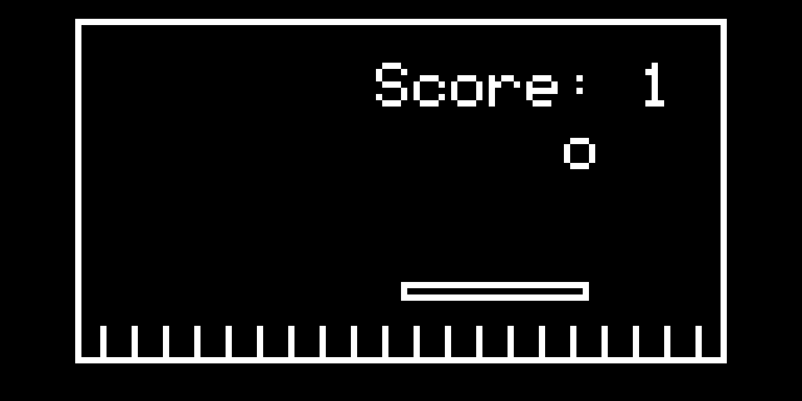
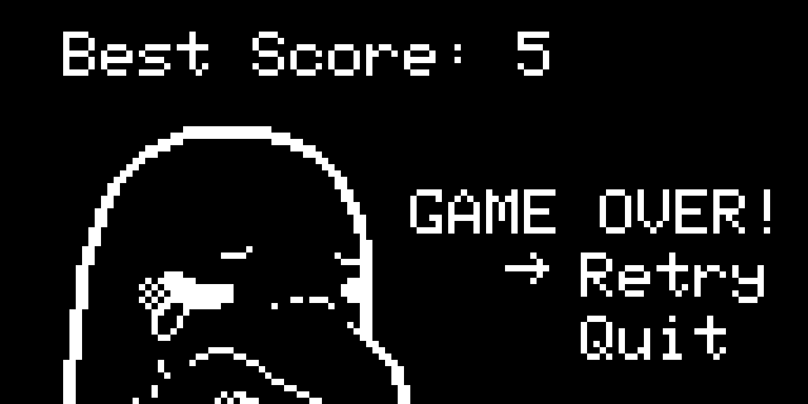
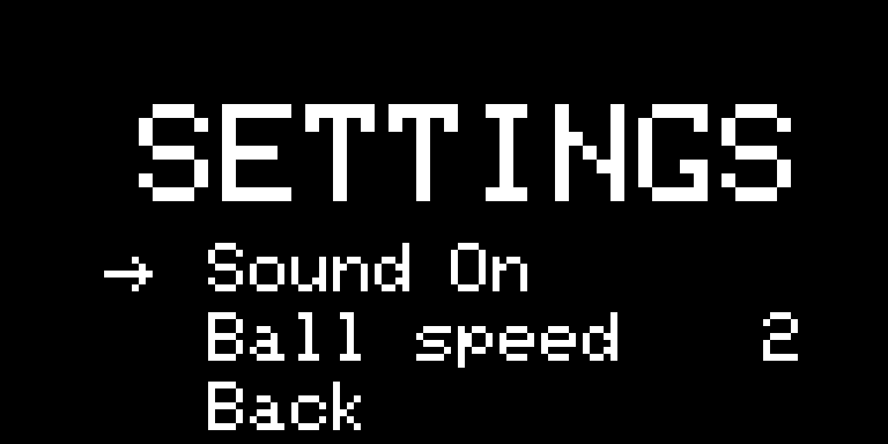

# Ball Catch

A classic ball bouncing game that runs on the AK Base Kit developed using an in-house AK Framework. Rather than breaking bricks, just keep the ball bouncing with your paddle and try to survive for as long as you can. Watch out though, more balls will keep coming the higher you score!

## Demo

<video src="https://github.com/user-attachments/assets/7cca0000-93b3-475d-9c2a-b95483678536" controls type="video/mp4"></video>

## Screens

<div align="center" >
    <figure>
        <p></p>
        <figcaption>Title</ficaption>
    </figure>
</div>

<br></br>

<div align="center">
    <figure>
        <p></p>
        <figcaption>Game</ficaption>
    </figure>
</div>

<br></br>

<div align="center">
    <figure>
        <p></p>
        <figcaption>Game over</ficaption>
    </figure>
</div>

<br></br>

<div align="center">
    <figure>
        <p></p>
        <figcaption>Settings</ficaption>
    </figure>
</div>

## In-Depth Documentation

For a more in-depth explanation of how the entire game works, check out [this doc](./resources/docs/runtime_sequence.md)

## Materials

- AK Base Kit
- 1 USB type C cable

## Getting Started

1. Install the [ak-flash CLI](https://github.com/the-ak-foundation/ak-flash)
1. Clone this repo
1. Load the boot firmware

    ```bash
    cd ak-base-kit-ball-catch/hardware/bin
    ak-flash /dev/ttyUSB0 ak-base-kit-stm32l151-boot.bin 0x08000000
    ```

1. Navigate to`./application`

    ```bash
    cd ../..
    cd application/
    ```

1. Run make

    ```bash
    make -j4
    ```

1. Finally, flash the application firmware into the kit, wait for a bit, and you're good to go!

    ```bash
    ak-flash /dev/ttyUSB0 ./build_ball/ball.bin 0x08003000
    ```

## Tutorial

- **UP**: Move paddle to the right
- **DOWN**: Move paddle to the left

## Debugging

Debugging is made easy with UART intergration and minicom! Assuming you're on Ubuntu, installing minicom is quite straightforward.

```bash
sudo apt-get install minicom
```

Then, launch minicom by setting the baud rate and the port in which is being used to connect to the kit. Before that though, be sure to connect your kit with your computer using a USB type C cable. Then, you'll be prompted to enter your password.

```bash
sudo minicom -b 115200 -D /dev/ttyUSB0
```

After that, here's what you might get on your terminal:

```bash
Welcome to minicom 2.9

OPTIONS: I18n
Port /dev/ttyUSB0, 16:11:52

Press CTRL-A Z for help on special keys

[BOOT] version: 0.0.1
[BOOT] start application

   __    _  _
  /__\  ( )/ )
 /(__)\ (   (
(__)(__)(_)\_)
Wellcome to Active Kernel 1.3

[PRINT] App run mode: DEBUG, App version: 0.0.0.3
[PRINT] Init mbMaster >> [PRINT] No error
[task_run] Active Objects is ready

-SIG-> AC_UART_IF_INIT
-LINK_PRINT- ----------
-LINK_PRINT- LINK_PDU pool size: 4 (pdu)
-LINK_PRINT- LINK_PDU buffer size: 384 (bytes)
-LINK_PRINT- MAX time link-frame fails: 1000 (ms)
-LINK_PRINT- MAX timeout send phy-frame: 250 (ms)
-LINK_PRINT- MAX timeout receive NEXT mac-frame: 250 (ms)
-LINK_PRINT- ----------
-SIG-> AC_DISPLAY_INITIAL
-SIG-> AC_DISPLAY_SHOW_IDLE
-SIG-> FW_CHECKING_REQ
```

To exit minicom, use the following commands in order:

1. Press `ctrl+A`
2. Press `z`
3. Press `q`

That's it! Have fun!
