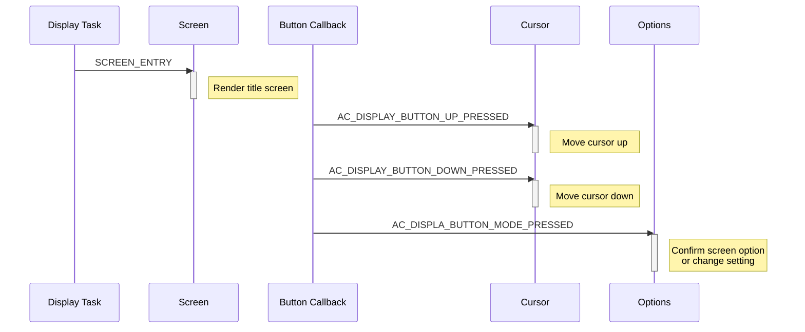
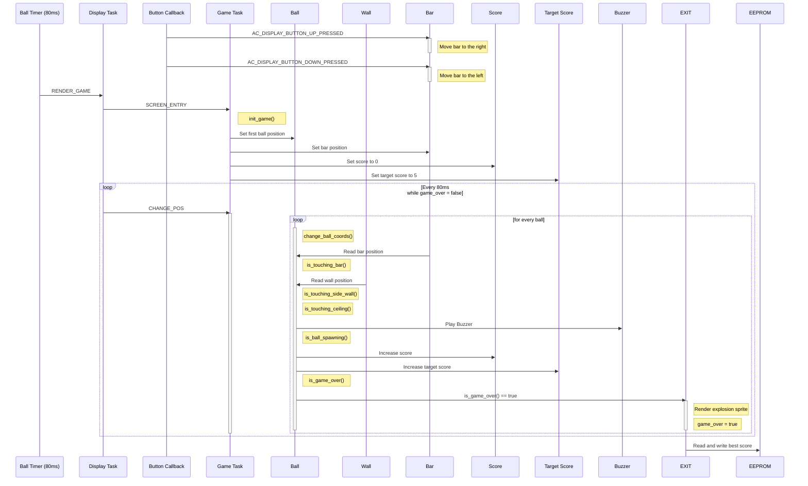

# Runtime sequence

## Overview

This document aims to explain Ball Catch's runtime sequence for each screen and how each object in each screens are handled.

Typically, games developed on the AK Base Kit would benefit from a seperate doc which explains the sequence of each object in a given game ([see Buu Quoc Phan's Archery Game](https://github.com/the-ak-foundation/archery-game)). However, this game is compact enough and only contain, practically speaking, two objects that has any substantial interaction. The crux of the entire game lies in the ball object which reads data from other objects and monitor its own behaviour. Thus, a seperate doc for objects' sequences might not be necessary.

## Screens

### Title & Game Over & Settings

These screen's operation is quite straightforward: move the cursor up and down and select your screen that you want.

### Game

The core screen of the entire program (because what is a game without a screen of actual gameplay?).

There are three key stages for a ball catch's game play loop

- Initialization
- Gameplay loop
- Game over

#### Initialization

The beginning of the game, where all data must be properly set up each and everytime we enter our game screen. It does a few things:

- Reset score back to 0
- Reset target score
- Set the first ball's position
- Set the bar's position
- Set game over status
- Kick start two timers
  - Render timer (RENDER_GAME)
  - Gameplay timer (CHANGE_POS)

#### Gameplay loop

The gameplay loops continously runs as long as the game is not over. During this phase, balls will keep bouncing around the screen. Bar is controllable through up and down buttons. After every 5 points, an additional ball will spawn. There could only be five balls in total in a single game. Should a single be dropped, it's game over.

#### Game over

Once it's game over, the game will freeze and a small explosion sprite will be drawn over the dropped ball. A two seconds timer will kick in and user will be redirected to the game over screen, where they can either play again or exit.

